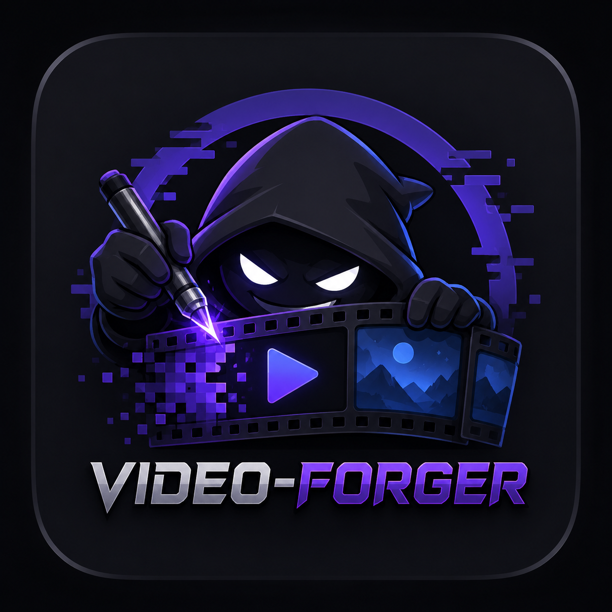
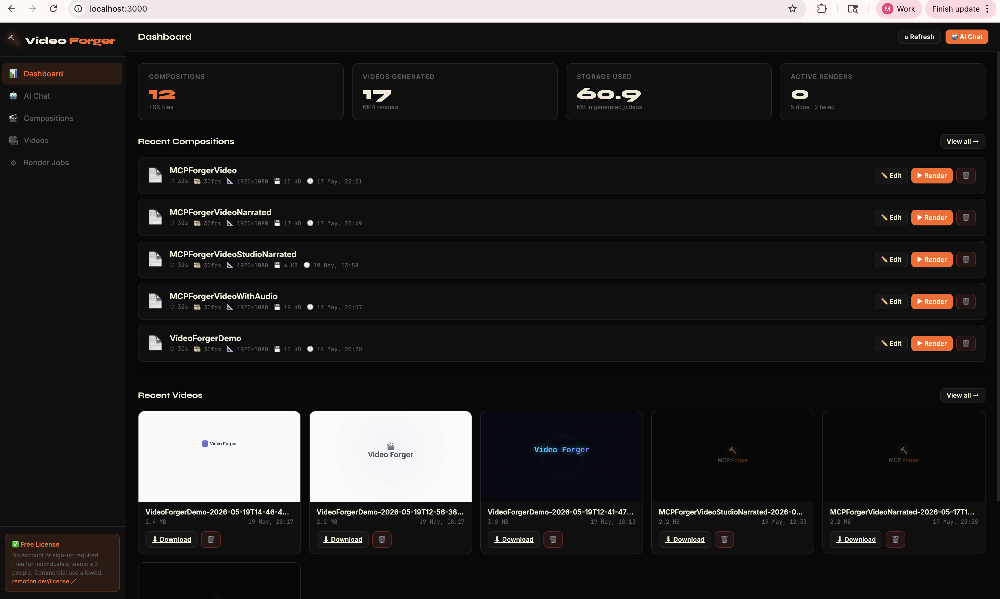

<p align="center">
  
</p>

<h1 align="center">Video Forger</h1>

<p align="center">
  <a href="https://github.com/coderXcode/video-forger/stargazers"></a>
  <a href="https://pypi.org/project/video-forger/"></a>
  
  
  
</p>

<p align="center">
  <strong>Describe a video. Watch it render. Ship it — in under 5 minutes.</strong>
</p>

<p align="center">
  No motion designer. No video editor. No rendering farm.<br/>
  Just one sentence — and a production-ready MP4 in your hands.
</p>

<p align="center">
  <b>Video Forger</b> runs entirely in Docker and works three ways:<br/>
  a <b>web dashboard</b>, a <b>REST API</b>, and a <b>Claude Desktop MCP plugin</b> —<br/>
  each powered by <a href="https://remotion.dev">Remotion</a> + headless Chromium.
</p>

<p align="center">
  <a href="#quick-start"><strong>→ Get started in 5 minutes</strong></a>
  &nbsp;·&nbsp;
  <a href="#claude-usage-examples">See example videos</a>
  &nbsp;·&nbsp;
  <a href="#api-reference">API docs</a>
</p>


---

### Who is this for?

| | |
|---|---|
| 🚀 **Founders & indie hackers** | Ship promo videos without hiring an agency — launch day sorted in an afternoon |
| 📣 **Marketers & growth teams** | Generate video creatives for every campaign without a production budget |
| 📊 **Data teams** | Animate charts and reports that actually get watched instead of ignored |
| 🛠️ **Developers** | Programmatic video via REST API — drop it into your CI/CD, cron job, or script |
| 🎙️ **Content creators** | AI voice-over + polished visuals in one command, no editing software needed |
| 🎓 **Educators & trainers** | Turn slides and walkthroughs into narrated explainer videos automatically |
| 📦 **Open-source maintainers** | Create killer project demos and release announcement videos that get stars |
| 🤖 **Claude power users** | Tell Claude what you want — it writes the code, renders it, and hands you the link |

---

## Features

- **AI Chat in the dashboard** — describe a video in plain English; Gemini writes TSX, renders it, iterates with you
- **Claude Desktop plugin** — full MCP integration; Claude creates, renders, and delivers videos without leaving the chat
- **AI voice narration** — Google AI Studio TTS generates voice-overs synced to your visuals
- **REST API** — every action is a clean HTTP call for automation or CI/CD
- **Web dashboard** — upload compositions, trigger renders, watch videos inline, manage jobs
- **Auto port detection** — finds a free port automatically if 3000 is taken
- **Docker-packaged** — one command to start; zero Node.js setup on the host

---

## Claude Usage Examples

### Product demo

<video src="https://github.com/coderXcode/video-forger/raw/main/sample_videos/product-demo.mp4" controls width="100%"></video>

```
Make me a 45-second product demo video for a SaaS tool called "Video Forger".
Use a dark theme with indigo, violet, and pink gradient accents throughout.
Show 5 scenes:

Hero — Logo spring-in with the tagline "Turn your words into stunning videos in minutes — not days." Add animated floating color orbs and sparkle particles in the background. Show 3 badges: Docker-packaged, Remotion-powered, Claude Plugin.
Features — Three dark cards with glowing colored borders for: "Describe It" (just tell Claude what you want), "Web Dashboard" (manage and watch renders live), and "Claude Plugin" (one-command setup).
How It Works — Four steps in a row: Describe → Generate → Render → Download, connected by an animated gradient line that draws itself across the screen.
By the Numbers — Four stat cards: < 5 min first video, 1 cmd to start, 0 Node.js required, ∞ videos you can create.
Outro — Pulsing glow background, logo, bold CTA text "Ship your first video in under 5 minutes", and the install command in a terminal-style box. Add AI voice narration (energetic tone, Puck voice) synced to each scene — no overlap between clips. No background music.
```

### Animated logo reveal

https://github.com/coderXcode/video-forger/raw/main/sample_videos/logo-reveal.mp4

```
Create a 10-second logo reveal animation for "Apex Labs".
Start with particles converging to the center, then the company name
springs in with a bounce effect. Use gold on black.
```

### Data visualization

https://github.com/coderXcode/video-forger/raw/main/sample_videos/data-viz.mp4

```
Build a 20-second animated bar chart video showing monthly revenue
growing from $10k in January to $95k in December.
Animate each bar rising one by one as the months progress.
```

### Social media short (9:16 vertical)

https://github.com/coderXcode/video-forger/raw/main/sample_videos/social-short.mp4

```
Make a 15-second vertical video (1080×1920) for Instagram Reels
announcing a summer sale: "50% OFF — Ends Sunday".
Bold text, bright orange gradient background, countdown feel.
```

### Code walkthrough

https://github.com/coderXcode/video-forger/raw/main/sample_videos/code-walkthrough.mp4

```
Create a 45-second video that reveals a Python quicksort function
line by line, with syntax highlighting.
Each line appears with a fade-in as if being typed.
```

### Presentation slides

https://github.com/coderXcode/video-forger/raw/main/sample_videos/presentation.mp4

```
Build a 60-second presentation video with 4 slides:
1. Title: "Q3 Results"
2. Revenue up 40% — animated bar chart
3. 3 bullet points about new product launches, each appearing with a spring animation
4. "Thank You" outro with company logo
Use a clean white and navy blue color scheme.
```

---

## Table of Contents

1. [Requirements](#requirements)
2. [Quick Start](#quick-start)
3. [Claude Desktop Plugin](#claude-desktop-plugin)
4. [Dashboard Usage](#dashboard-usage)
6. [Video Types](#video-types)
7. [TSX Composition Format](#tsx-composition-format)
8. [AI Voice Narration (TTS)](#ai-voice-narration-tts)
9. [Environment Variables](#environment-variables)
10. [API Reference](#api-reference)
11. [Project Structure](#project-structure)
12. [License](#license)

---

## Requirements

### Required

| Dependency | Version | Install |
|---|---|---|
| **Docker Desktop** | 4.x+ | [docker.com/products/docker-desktop](https://www.docker.com/products/docker-desktop) |

> **Node.js is NOT required on the host.** The entire runtime (Node.js 20, Remotion, Chromium) runs inside Docker.

### Optional — Claude Desktop plugin

| Dependency | Install |
|---|---|
| **Claude Desktop** | [claude.ai/download](https://claude.ai/download) |

### Optional — AI voice narration

| Dependency | How |
|---|---|
| **Google AI Studio API key** | [aistudio.google.com/apikey](https://aistudio.google.com/apikey) — free tier available |

---

## Quick Start

Choose one setup path:

### A) via pip

Video Forger is available on PyPI as a thin launcher. Docker must be installed — nothing runs via Python itself.

#### 1. Install

```bash
pip install video-forger
```

#### 2. Initialize project files

```bash
mkdir my-videos && cd my-videos
video-forger init
```

`video-forger init` copies the project template (Dockerfile, docker-compose.yml, server.js, `.env.example`, etc.) into the current directory. Your `.env` lives **here**, alongside those files.

#### 3. Configure `.env` (optional but recommended)

```bash
cp .env.example .env
```

Then open `.env` and add your Google AI Studio key:

```env
GOOGLE_AI_STUDIO_API_KEY=your_key_here
```

Get a free key (no billing required) at [aistudio.google.com/apikey](https://aistudio.google.com/apikey).

With this key you get:
- **AI Chat** — describe videos in plain English, the dashboard writes and renders them for you
- **Voice narration** — auto-generates narration audio for your videos via Gemini TTS


#### 4. Start

```bash
video-forger start
```

Other commands:

```bash
video-forger stop          # Stop the running Docker container
video-forger --help        # Show all options
```

### B) via git clone

#### 1. Clone

```bash
git clone https://github.com/coderXcode/video-forger
cd video-forger
```

#### 2. Configure `.env` (optional but recommended)

Copy the example and add your Google AI Studio key to unlock AI Chat and voice narration:

```bash
cp .env.example .env   # or create .env manually
```

```env
# .env
GOOGLE_AI_STUDIO_API_KEY=your_key_here
```

Get a free key (no billing required) at [aistudio.google.com/apikey](https://aistudio.google.com/apikey).

With this key you get:
- **AI Chat** — describe videos in plain English, the dashboard writes and renders them for you
- **Voice narration** — auto-generates narration audio for your videos via Gemini TTS

Without it, Video Forger still works — you just write TSX manually and the Chat panel will say the key is missing.

#### 3. Start

```bash
chmod +x start.sh
./start.sh
```

`start.sh` will automatically:

1. ✅ Verify Docker is running
2. ✅ Find a free port (starts at 3000, increments if busy)
3. ✅ Build the Docker image (~3 min first run — Chromium is large)
4. ✅ Start the container
5. ✅ Register the MCP plugin with Claude Desktop (if installed)
6. ✅ Open the dashboard in your browser

To stop:

```bash
docker compose down
```

---

## Dashboard Usage



Open [http://localhost:3000](http://localhost:3000) (or whichever port was auto-selected) after starting.

### Pages

| Page | What it does |
|---|---|
| **Dashboard** | Overview: composition count, video count, active and completed renders |
| **AI Chat** | Describe a video in plain English — Gemini writes the TSX, renders it, lets you iterate |
| **Compositions** | Browse, edit source, and delete uploaded TSX files |
| **Videos** | Watch rendered MP4 files inline with full seek support; download |
| **Render Jobs** | Live progress bars for all render jobs with logs |

### Typical workflow using AI Chat (in testing)

1. Open **AI Chat** and describe the video you want
2. Gemini writes the TSX composition and uploads it automatically
3. Say **"render it"** — the chat triggers the render and shows live progress
4. Watch the video inline in chat; ask for changes ("make the text bigger", "add a blue background")
5. Gemini updates the composition and re-renders on your instruction

### Manual workflow (no API key needed)

1. Write a `.tsx` file following the format below
2. Upload it via **Compositions → + New** or the API
3. Click **▶ Render** on the composition card
4. Open **Videos** to watch and download the result

---

## Claude Desktop Plugin

When `./start.sh` runs, it **automatically registers** Video Forger in Claude Desktop's config:

- **macOS**: `~/Library/Application Support/Claude/claude_desktop_config.json`
- **Linux**: `~/.config/Claude/claude_desktop_config.json`

After registration, **quit and reopen Claude Desktop**. Video Forger appears in the MCP tools panel.

### Manual registration

If auto-registration was skipped, add this to your `claude_desktop_config.json`:

```json
{
  "mcpServers": {
    "video-forger": {
      "command": "docker",
      "args": ["exec", "-i", "video-forger", "node", "/app/mcp-server.js"]
    }
  }
}
```

Requires the `video-forger` Docker container to be running (`./start.sh`).

### Available MCP tools

| Tool | What Claude uses it for |
|---|---|
| `get_video_capabilities` | Learn the TSX format and available video types |
| `list_compositions` | See uploaded compositions |
| `create_composition` | Write and upload TSX code |
| `update_composition` | Edit an existing composition |
| `generate_narration` | Generate a voice-over audio file from text (Google TTS) |
| `render_video` | Trigger a render job |
| `get_render_status` | Poll progress until complete |
| `list_rendered_videos` | List finished MP4s with direct links |
| `delete_composition` | Remove a composition |

---

## Video Types

| Type | Description | Duration | Resolution |
|---|---|---|---|
| **Product / Feature Demo** | Animated slides with feature callouts and smooth transitions | 30s | Any |
| **Explainer / Narrated** | Visuals synchronized to AI voice-over | 30–60s | Any |
| **Data Visualization** | Animated charts and counters | 15–30s | Any |
| **Title Card / Logo Reveal** | Spring animations, fade-ins, scale effects | 5–15s | Any |
| **Code Walkthrough** | Syntax-highlighted code revealed line by line | 30–90s | Any |
| **Social Short (9:16)** | Vertical format for Reels / TikTok / Shorts | 15–30s | Any |
| **Presentation Slides** | Multi-scene with bullet-reveal animations | 60–120s | Any |
| **Countdown Promo** | Animated timer with glow/particle effects | 15–30s | Any |

---

## TSX Composition Format

Every composition file must follow this structure:

```tsx
// @remotion durationInFrames=900 fps=30 width=1920 height=1080
import React from 'react';
import { AbsoluteFill, useCurrentFrame, interpolate, spring, useVideoConfig } from 'remotion';

export default function MyVideo() {
  const frame = useCurrentFrame();
  const { fps } = useVideoConfig();

  const opacity = interpolate(frame, [0, 30], [0, 1], { extrapolateRight: 'clamp' });
  const scale   = spring({ frame, fps, config: { stiffness: 80 } });

  return (
    <AbsoluteFill style={{ background: '#111', justifyContent: 'center', alignItems: 'center' }}>
      <div style={{
        opacity,
        transform: `scale(${scale})`,
        color: '#fff',
        fontSize: 72,
        fontFamily: 'sans-serif',
      }}>
        Hello, Video Forger!
      </div>
    </AbsoluteFill>
  );
}
```

### Rules

- **Line 1** must be the `// @remotion durationInFrames=... fps=... width=... height=...` comment
- Must have a **default export** that is a React function component
- No external npm packages beyond what ships in the image (`remotion`, `react`, `react-dom`)
- For audio in TSX: always use **absolute URLs** — `http://localhost:3000/api/audio/filename.wav` — relative URLs fail during rendering because Remotion resolves them against its internal webpack server

### Core Remotion APIs

| API | Returns | Description |
|---|---|---|
| `useCurrentFrame()` | `number` | Current frame index (0 → durationInFrames − 1) |
| `useVideoConfig()` | `object` | `{ fps, durationInFrames, width, height }` |
| `interpolate(frame, [in0, in1], [out0, out1], opts)` | `number` | Map frame range to value range. Use `extrapolateRight: 'clamp'` |
| `spring({ frame, fps, config })` | `number` | Physics spring animation (0 → 1). `config: { stiffness, damping, mass }` |
| `<AbsoluteFill>` | JSX | Full-bleed positioned container (position: absolute, inset: 0) |
| `<Sequence from={n} durationInFrames={n}>` | JSX | Render children only during a time window |
| `<Audio src="url" volume={0.5} />` | JSX | Audio track. Use absolute URL |
| `` | JSX | Frame-safe image (waits for asset to load) |

### Duration guide

| Duration | Frames (at 30fps) |
|---|---|
| 5s | 150 |
| 10s | 300 |
| 15s | 450 |
| 30s | 900 |
| 60s | 1800 |
| 90s | 2700 (max recommended) |

---

## AI Voice Narration (TTS)

Video Forger supports Google AI Studio (Gemini) for voice-over generation.

### Setup

Add to your `.env`:

```env
GOOGLE_AI_STUDIO_API_KEY=your_key_here
GOOGLE_AI_STUDIO_TTS_MODEL=gemini-2.5-flash-preview-tts
GOOGLE_AI_STUDIO_TTS_VOICE=Kore
GOOGLE_AI_STUDIO_TTS_SPEAKING_RATE=1.0
GOOGLE_AI_STUDIO_TTS_PITCH=0.0
```

Get a free API key at [aistudio.google.com](https://aistudio.google.com/apikey).

### Generate custom audio via API

```bash
curl -X POST http://localhost:3000/api/tts/google \
  -H 'Content-Type: application/json' \
  -d '{
    "text": "Welcome to our product. Let'\''s get started.",
    "filename": "welcome-narration"
  }'
```

Returns `{ "publicUrl": "/audio/welcome-narration.wav" }`.

Use in TSX:

```tsx
<Audio src="http://localhost:3000/audio/welcome-narration.wav" volume={0.9} />
```

---

## Environment Variables

Configure in `.env` in the project root before running `./start.sh`:

```env
# ── Google AI Studio TTS (optional) ──────────────────────────────────────────
GOOGLE_AI_STUDIO_API_KEY=            # Your AI Studio API key
GOOGLE_AI_STUDIO_TTS_MODEL=gemini-2.5-flash-preview-tts
GOOGLE_AI_STUDIO_TTS_VOICE=Kore      # Voice name
GOOGLE_AI_STUDIO_TTS_SPEAKING_RATE=1.0   # 0.25 – 4.0
GOOGLE_AI_STUDIO_TTS_PITCH=0.0           # -20.0 – 20.0

# ── Advanced (usually leave as defaults) ─────────────────────────────────────
VIDEO_FORGER_ORIGIN=http://localhost:3000  # Base URL for audio assets in TSX renderers
VIDEO_FORGER_CONTAINER=video-forger        # Docker container name
NARRATION_COMPOSITIONS=MCPForgerVideoNarrated,MCPForgerVideoStudioNarrated
                                           # Comma-separated composition names that
                                           # trigger automatic TTS pre-generation

# ── Set by start.sh automatically ────────────────────────────────────────────
# STUDIO_PORT=3000       # Set manually to force a specific host port
```

---

## API Reference

All endpoints are on the running server (default `http://localhost:3000`).

### Compositions

| Method | Path | Body / Params | Description |
|---|---|---|---|
| `GET` | `/api/compositions` | — | List all uploaded compositions |
| `GET` | `/api/compositions/:name` | — | Get source code + metadata |
| `POST` | `/api/compositions` | `multipart: file=<.tsx>` | Upload a new composition |
| `PUT` | `/api/compositions/:name` | `{ "content": "..." }` | Update source code |
| `DELETE` | `/api/compositions/:name` | — | Delete a composition |

### Rendering

| Method | Path | Body | Description |
|---|---|---|---|
| `POST` | `/api/render/:name` | — | Start a render → `{ "jobId": "..." }` |
| `GET` | `/api/jobs` | — | List all render jobs |
| `GET` | `/api/jobs/:id` | — | Job status, progress %, logs, output filename |

### Videos

| Method | Path | Description |
|---|---|---|
| `GET` | `/api/videos` | List rendered MP4 files |
| `GET` | `/api/videos/stream/:filename` | Stream/download with HTTP range request support |
| `DELETE` | `/api/videos/:filename` | Delete a video file |

### TTS / Audio

| Method | Path | Body | Description |
|---|---|---|---|
| `POST` | `/api/tts/google` | `{ text, filename?, voiceName?, speakingRate?, pitch? }` | Generate audio from text |
| `GET` | `/api/audio/:filename` | — | Serve a generated audio file |

### MCP + Utility

| Method | Path | Description |
|---|---|---|
| `GET` | `/api/mcp/capabilities` | Full guide: video types, TSX format, workflow (used by Claude) |
| `GET` | `/api/health` | Health check → `{ "status": "ok" }` |
| `GET` | `/api/stats` | Dashboard stats: composition count, video count, job counts |

---

## Project Structure

```
video-forger/
├── start.sh                    # One-command launcher (build → start → register MCP)
├── mcp-docker-bridge.sh        # Claude Desktop → Docker stdio bridge
├── mcp-server.js               # MCP tool server (stdio, JSON-RPC 2.0, runs in Docker)
├── server.js                   # Express REST API + render engine
├── index.html                  # Dashboard UI (vanilla JS, no build step)
├── docker-compose.yml          # Service definition
├── Dockerfile                  # Node 20 + Chromium image
├── package.json
├── remotion.config.ts
├── tsconfig.json
├── index.ts                    # Remotion entry point
├── src/
│   └── Root.tsx                # Auto-generated — lists registered compositions
├── public/
│   └── audio/                  # Generated TTS audio cache
├── project_mnts/               # Host-mounted volume (persists across restarts)
│   ├── uploaded_tsx/           # Your TSX composition files
│   └── generated_videos/       # Rendered MP4 output
└── video_forger/               # Python pip package
    ├── __init__.py
    ├── cli.py
    └── assets/                 # Project files bundled with the pip package
```

---

## License

Video Forger is released under the **MIT License**.

This project uses [Remotion](https://remotion.dev) for video rendering.
Remotion is **free** for individuals and teams of 3 or fewer people.
For larger teams, a Remotion license is required — see [remotion.dev/license](https://remotion.dev/license).
